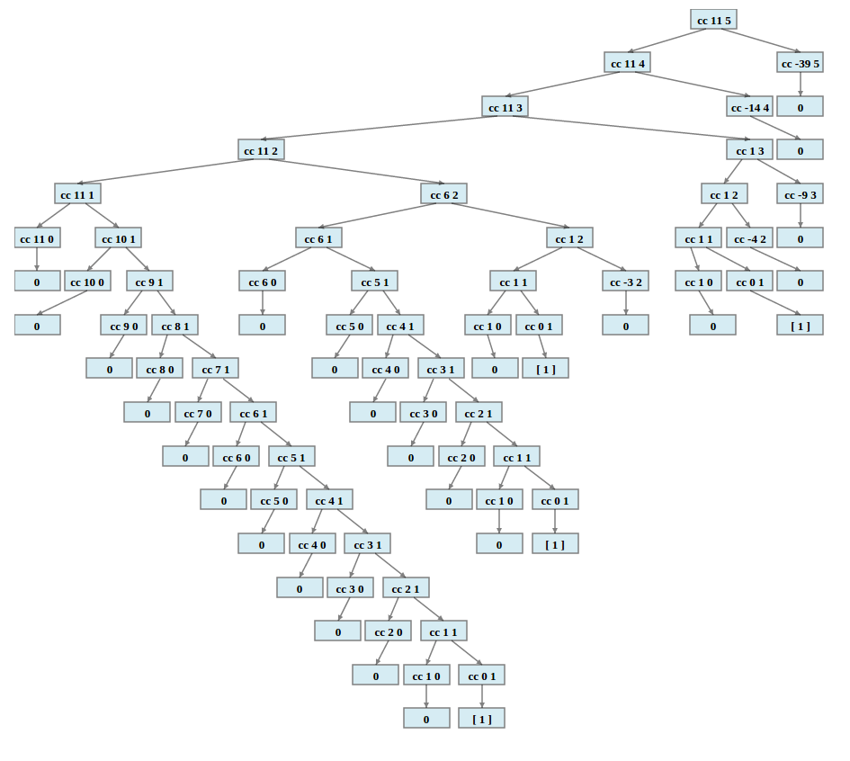

# [Глава 1](./index.md#Глава-1-Построение-абстракций-с-помощью-процедур)

### Упражнение 1.14
Нарисуйте дерево, иллюстрирующее процесс, который порождается процедурой `count-change` при размене 11 центов. Каковы порядки роста памяти и числа шагов, используемых этим процессом при увеличении суммы, которую требуется разменять?

```clojure
(defn first-denomination [kinds-of-coins]
  (cond
    (= kinds-of-coins 1) 1
    (= kinds-of-coins 2) 5
    (= kinds-of-coins 3) 10
    (= kinds-of-coins 4) 25
    (= kinds-of-coins 5) 50))

(defn cc [amount kinds-of-coins]
  (cond
    (zero? amount) 1
    (or (neg? amount)
        (zero? kinds-of-coins)) 0
    :else (+ (cc amount
                 (dec kinds-of-coins))
             (cc (- amount
                    (first-denomination kinds-of-coins))
                 kinds-of-coins))))

(defn count-change [amount]
  (cc amount
      5))
```

#### Решение
Используя метод подстановки, видим что функция `(count-change 11)` создаёт следующий процесс:
```clojure
(cc 11 5)
(+ (cc 11 4) (cc -39 5))
(+ (+ (cc 11 3) (cc -14 4)) 0)
(+ (+ (+ (cc 11 2) (cc 1 3)) 0) 0)
(+ (+ (+ (+ (cc 11 1) (cc 6 2)) (+ (cc 1 2) (cc -9 3))) 0) 0)
(+ (+ (+ (+ (+ (cc 11 0) (cc 10 1)) (+ (cc 6 1) (cc 1 2))) (+ (+ (cc 1 1) (cc -4 2)) 0)) 0) 0)
(+ (+ (+ (+ (+ 0 (+ (cc 10 0) (cc 9 1))) (+ (+ (cc 6 0) (cc 5 1)) (+ (cc 1 1) (cc -3 2)))) (+ (+ (+ (cc 1 0) (cc 0 1)) 0) 0)) 0) 0)
(+ (+ (+ (+ (+ 0 (+ 0 (+ (cc 9 0) (cc 8 1)))) (+ (+ 0 (+ (cc 5 0) (cc 4 1))) (+ (+ (cc 1 0) (cc 0 1)) 0))) 1) 0) 0)
(+ (+ (+ (+ (+ 0 (+ 0 (+ 0 (+ (cc 8 0) (cc 7 1))))) (+ (+ 0 (+ 0 (+ (cc 4 0) (cc 3 1)))) (+ (+ 0 1) 0))) 1) 0) 0)
(+ (+ (+ (+ (+ 0 (+ 0 (+ 0 (+ 0 (+ (cc 7 0) (cc 6 1)))))) (+ (+ 0 (+ 0 (+ 0 (+ (cc 3 0) (cc 2 1))))) 1)) 1) 0) 0)
(+ (+ (+ (+ (+ 0 (+ 0 (+ 0 (+ 0 (+ 0 (+ (cc 6 0) (cc 5 1))))))) (+ (+ 0 (+ 0 (+ 0 (+ 0 (+ (cc 2 0) (cc 1 1)))))) 1)) 1) 0) 0)
(+ (+ (+ (+ (+ 0 (+ 0 (+ 0 (+ 0 (+ 0 (+ 0 (+ (cc 5 0) (cc 4 1)))))))) (+ (+ 0 (+ 0 (+ 0 (+ 0 (+ 0 (+ (cc 1 0) (cc 0 1))))))) 1)) 1) 0) 0)
(+ (+ (+ (+ (+ 0 (+ 0 (+ 0 (+ 0 (+ 0 (+ 0 (+ 0 (+ (cc 4 0) (cc 3 1))))))))) 2) 1) 0) 0)
(+ (+ (+ (+ (+ 0 (+ 0 (+ 0 (+ 0 (+ 0 (+ 0 (+ 0 (+ 0 (+ (cc 3 0) (cc 2 1)))))))))) 2) 1) 0) 0)
(+ (+ (+ (+ (+ 0 (+ 0 (+ 0 (+ 0 (+ 0 (+ 0 (+ 0 (+ 0 (+ 0 (+ (cc 2 0) (cc 1 1))))))))))) 2) 1) 0) 0)
(+ (+ (+ (+ (+ 0 (+ 0 (+ 0 (+ 0 (+ 0 (+ 0 (+ 0 (+ 0 (+ 0 (+ 0 (+ (cc 1 0) (cc 0 1)))))))))))) 2) 1) 0) 0)
(+ (+ (+ (+ (+ 0 (+ 0 (+ 0 (+ 0 (+ 0 (+ 0 (+ 0 (+ 0 (+ 0 (+ 0 (+ 0 1))))))))))) 2) 1) 0) 0)
4
```

что может быть также представленно в виде дерева:




[Code](../src/sicp/chapter01/1_14.clj) | [Test](../test/sicp/chapter01/1_14_test.clj)
